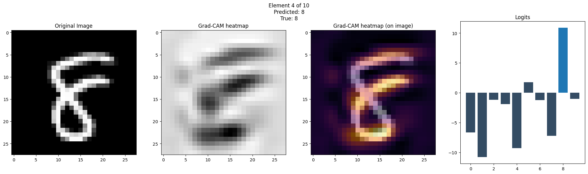
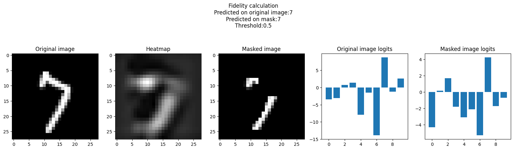

# MNIST classification NN & Grad-CAM interpretation implementation
This repository is my interview task for ISP RAS Information systems department.

## Task structure
1. Train a CNN with at least 80% precision.
1. Implement a [Grad-CAM approach](https://arxiv.org/pdf/1611.07450).  
1. Test model on a random batch (at least 5 pictures): display source, heatmap, model prediction for the picture and its true value.
1. Compute Fidelity for every image in a batch, compute average fidelity and its dispersion.

## Example
Here the heatmap for image containing digit 8 is displayed. The logits are also shown on the right plot 

Grad-CAM efficienty is estimated via Fidelity. There is an example below of digit 7 masked with its heatmap, the plots on the right demonstrate that CNN-based model doesn't change its opinion about probabilities of each digit a lot.  

## Article

This repository is just a particular implementation of techniques proposed in the [Grad-CAM: Why did you say that?](https://arxiv.org/pdf/1611.07450) article.